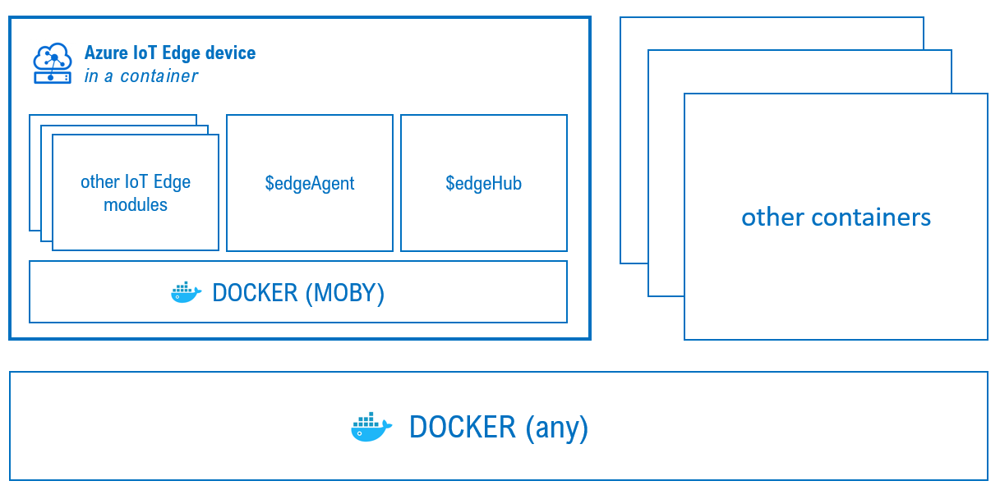

# iotedge-device-container
An IoT Edge instance in a container.
It includes the IoT Edge runtime and a container engine itself.



This work is based on this [repo](https://github.com/toolboc/azure-iot-edge-device-container) with the following changes:
* x86 only
* no self-provisioning, manual provisioning only via connection string in a .env file
* not tied to a specific version of iot edge runtime available, it will use the lastest one

As described [here](https://docs.microsoft.com/en-us/azure/iot-edge/development-environment#iot-edge-device-container):
*"The IoT Edge device container is a complete IoT Edge device, ready to be launched on any machine with a container engine. The device container includes the IoT Edge runtime and a container engine itself. Each instance of the container is a fully functional self-provisioning IoT Edge device. The device container supports remote debugging of modules, as long as there is a network route to the module. The device container is good for quickly creating large numbers of IoT Edge devices to test at-scale scenarios or Azure Pipelines. It also supports deployment to kubernetes via helm."*

## build
```
build-container.sh <docker-host> <image>
```
where:
* `<docker-host>` is the docker host you want to use to build the image (ex. 127.0.0.1 or any other)
* `<image>` is the image tag (ex. repo/image:tag)

example:
```
build-container.sh 192.168.2.96 arturol76/iotedgec
```

## run
```
build-container.sh <docker-host> <image>
```
where:
* `<docker-host>` is the docker host you want to run the container on (ex. 127.0.0.1 or any other)
* `<image>` is the image tag (ex. repo/image:tag)
It will create and run a container with id = 'iotedgec'

example:
```
run-container.sh 192.168.2.96 arturol76/iotedgec
```


## iotedge cli
```
exec-bash.sh <docker-host>
```
where:
* `<docker-host>` is the docker host where the 'iotedgec' container is running (ex. 127.0.0.1 or any other)

example:
```
exec-bash.sh 192.168.2.96
```

## .env file
Create an .env file with the iot hub connection string as follows:
```
DEVICE_CONNECTION_STRING=HostName=xyz.azure-devices.net;DeviceId=xxx;SharedAccessKey=xxxxxxxxyyyyyyyyyyyyyzzzzzzzzz
```
Save the file in the same folder as the 'run-container.sh' file.
